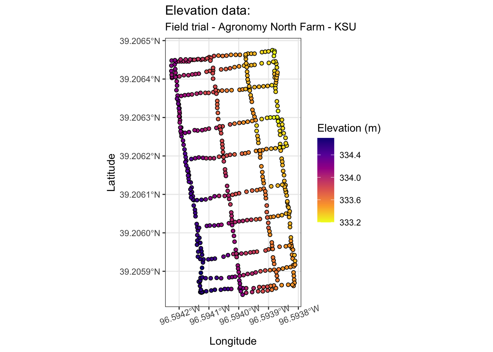
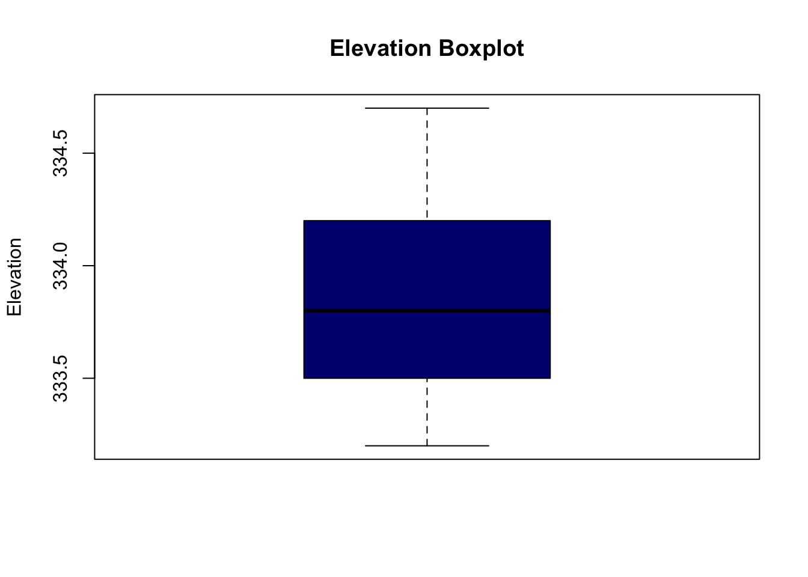
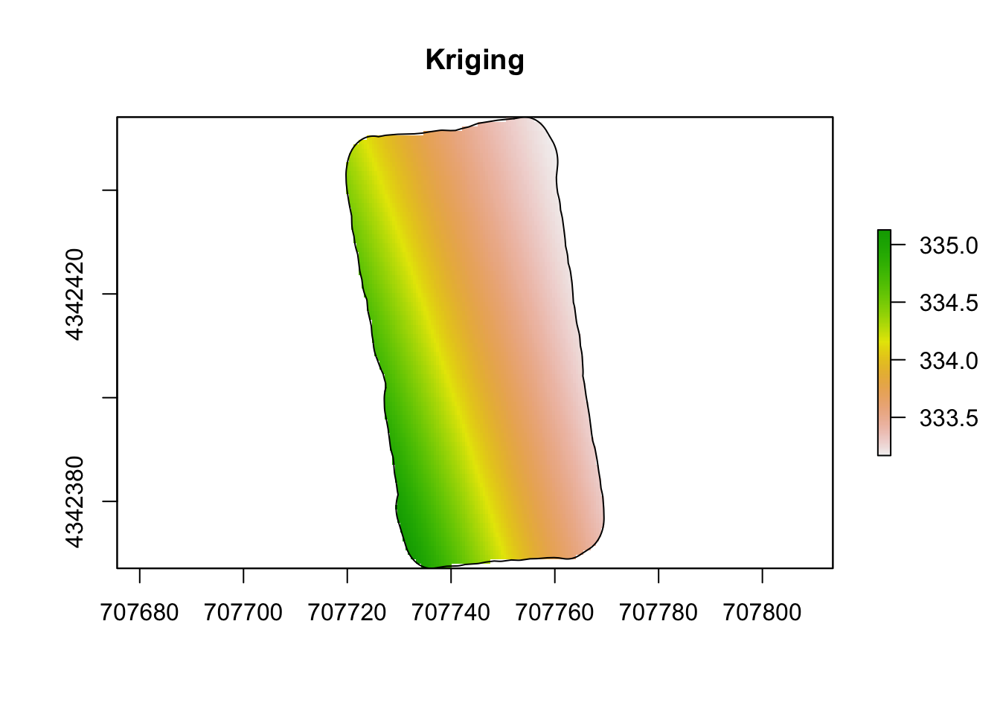

# Activity 2


## Library


```r
library(sf)
library(sp)
library(raster)
library(ggplot2)
library(nlme)
library(mapview)
library(dplyr)
library(gstat)
library(mgcv)
```

## Chose an area on or close to campus where it is easy for you to understand how the elevation changes. Using a smartphone record the elevation at several locations (points) within the area you chose.

Area: Agronomy North Farm (2201 North Farm - Research Center)

## Obtain a .gpx or .csv file for your elevation data. At minimum the file should contain the location and time of the elevation measurements.

Data was obtained using the app Strava.


```r
# Download shapefile of Kansas from census.gov
download.file("http://www2.census.gov/geo/tiger/GENZ2015/shp/cb_2015_us_state_20m.zip", destfile = "states.zip")
unzip("states.zip")
sf.us <- st_read("cb_2015_us_state_20m.shp")
```

```
## Reading layer `cb_2015_us_state_20m' from data source 
##   `/Users/bosche/Desktop/stat_764_portfolio/cb_2015_us_state_20m.shp' 
##   using driver `ESRI Shapefile'
## Simple feature collection with 52 features and 9 fields
## Geometry type: MULTIPOLYGON
## Dimension:     XY
## Bounding box:  xmin: -179.1743 ymin: 17.91377 xmax: 179.7739 ymax: 71.35256
## Geodetic CRS:  NAD83
```

```r
sf.kansas <- sf.us[48,6]
sf.kansas <- as(sf.kansas, 'Spatial')
```


```r
# Shapefile of study area at Agronomy North Farm - KSU (Manhattan KS)
url <- "https://www.dropbox.com/scl/fi/umgo5u6ns6jkbbykqcq90/study_area.gpx?rlkey=63gjxiifvb4xq7ll25bfwyb8c&dl=1"
pt.study.area <- st_read(dsn=url,layer="track_points")
```

```
## Reading layer `track_points' from data source 
##   `https://www.dropbox.com/scl/fi/umgo5u6ns6jkbbykqcq90/study_area.gpx?rlkey=63gjxiifvb4xq7ll25bfwyb8c&dl=1' 
##   using driver `GPX'
## Simple feature collection with 122 features and 26 fields
## Geometry type: POINT
## Dimension:     XY
## Bounding box:  xmin: -96.59424 ymin: 39.20581 xmax: -96.5938 ymax: 39.20647
## Geodetic CRS:  WGS 84
```

```r
sf.study.area  <- st_polygon(list(rbind(st_coordinates(pt.study.area),st_coordinates(pt.study.area)[1,])))
sf.study.area <- st_buffer(sf.study.area, .00006)
sf.study.area <- st_sf(st_sfc(sf.study.area), crs = crs(sf.kansas))

plot(sf.study.area)
```


```r
url <- "https://www.dropbox.com/scl/fi/1b5r111l0man0la5wr1vg/NF_mungbean_trial.gpx?rlkey=80dv7ghjwt57299bwip2t4iqz&dl=1"
pt.elev <- st_read(dsn=url,layer="track_points")
```

```
## Reading layer `track_points' from data source 
##   `https://www.dropbox.com/scl/fi/1b5r111l0man0la5wr1vg/NF_mungbean_trial.gpx?rlkey=80dv7ghjwt57299bwip2t4iqz&dl=1' 
##   using driver `GPX'
## Simple feature collection with 492 features and 26 fields
## Geometry type: POINT
## Dimension:     XY
## Bounding box:  xmin: -96.59423 ymin: 39.20584 xmax: -96.59381 ymax: 39.20647
## Geodetic CRS:  WGS 84
```

```r
pt.elev <- pt.elev[,4] 
```

## Plot/map your elevation data. I would recommend using R and/or Google earth.


```r
ggplot()+
  geom_sf(data = pt.elev, aes(fill = ele ), shape = 21)+
  scale_fill_viridis_c(option = "plasma", direction = -1)+
  labs(x = 'Longitude', y = 'Latitude')+
  theme_bw()+
  theme(axis.text.x = element_text(angle = 20))+
  labs(title = "Elevation data:",
       subtitle = "Field trial - Agronomy North Farm - KSU",
       fill = "Elevation (m)")
```



## Create data frame: elevation, longitude, latitude


```r
# Transform data to a planar coordinate reference system

pt.elev.utm <- st_transform(pt.elev,CRS("+proj=utm +zone=14 +datum=WGS84  +units=m"))
sf.study.area.utm <- st_transform(sf.study.area,CRS("+proj=utm +zone=14 +datum=WGS84  +units=m"))


# Create data frame
df.elev <- data.frame (elev = pt.elev$ele,
                          long = st_coordinates(pt.elev)[,1],
                          lat = st_coordinates(pt.elev)[,2],
                          s1 = st_coordinates(pt.elev.utm)[,1],
                          s2 = st_coordinates(pt.elev.utm)[,2])
```

The data seems to be okay, no major problems. I'd say that I wasn't expect to see more than 1 meter in elevation change, however I already knew this field has lower elevation towards east. 


```r
# Summary statistics

summary(pt.elev$ele)
```

```
##    Min. 1st Qu.  Median    Mean 3rd Qu.    Max. 
##   333.2   333.5   333.8   333.8   334.2   334.7
```

```r
# Box Plot

boxplot(pt.elev$ele, main = "Elevation Boxplot", ylab = "Elevation", col = "navy")
```



```r
# Histogram
hist(pt.elev$ele,col="navy", xlim = c(333, 335), breaks = 7, main="Histogram of elevation",xlab="elevation (m)")
```


```r
# Density Plot
ggplot() +
  geom_density(aes(x = pt.elev$ele), fill = "navy", alpha = 0.8) +
  xlim(333, 335)+
  labs(title = "Elevation Density Plot", x = "Elevation", y = "Density")+
  theme_bw()
```


## Write out the goals that you wish to accomplish using your elevation data. For example, my goal was to make a map of the Dicken’s Hall parking lot. This involves using the elevation data I collected to make predictions of the elevation at any possible spatial locations within the parking lot. I would also like to make inference about the location where the elevation is lowest within the parking lot.

My goal is to identify elevation change patterns in a specific field at Agronomy North Farm, where we plan to have an experiment this year. First of all, I wanna create an elevation map of the field, a map showing the elevation variations across the entire field. Then, I want to use the elevation data to pinpoint the lowest elevation points within the field. These areas are more susceptible to flooding and may require special attention in my experiment planning (how to place experimental blocks within the field). In addition to that, make sure the blocks are situated in areas with minimal elevation variation to minimize potential biases.

##  Write out several statistical or machine learning models that you think you can use to answer the questions/goals you wrote in prompt #5. Be as creative and inclusive here. For each statistical or machine learning model, make sure you explain each component (piece) of the model.

Linear model:    
$y_i = \beta_0 + \beta_1\cdot lon + \beta_2\cdot lon^2 + \beta_3\cdot lat + \beta_4\cdot lat^2 + \epsilon_i$  
$\epsilon_i \sim \mathcal{N}(0, \sigma^2)$  

GAM Model: 
$y_i= \beta_0 + f(lon, lat) + \epsilon_i$  
$\epsilon_i \sim \mathcal{N}(0, \sigma^2)$

##  Of the models you developed in prompt #6, find (or develop) software to fit at least two of these models to your elevation data. Note that in a perfect world, you would be able to either find existing software or develop new programs that enable you to fit any statistical or machine learning model you want. In reality, you may may end up having to make some unwanted changes to your models in prompt #6 to be able to find existing software to fit these models to the data. 

### Model 1: Non-hierarchical linear model with iid errors


```r
# Second order polynomial model

m1 <- lm(elev~s1+I(s1^2)+s2+I(s2^2),data=df.elev)

# Make raster of study area to be able to map predictions from m1
rl.E.y <- raster(,nrow=100,ncols=100,ext=extent(sf.study.area.utm),crs=crs(sf.study.area.utm))

# Make data.frame to be able to make predictions at each pixel (cell of raster)
df.pred <- data.frame(elev = NA,
                      s1 = xyFromCell(rl.E.y,cell=1:length(rl.E.y[]))[,1],
                      s2 = xyFromCell(rl.E.y,cell=1:length(rl.E.y[]))[,2])

# Make spatial predictions at each pixel
df.pred$elev <- predict(m1,newdata=df.pred) 


# View first 6 rows of predictions
head(df.pred) 
```

```
##       elev       s1      s2
## 1 334.2992 707720.0 4342454
## 2 334.2813 707720.5 4342454
## 3 334.2633 707721.0 4342454
## 4 334.2453 707721.5 4342454
## 5 334.2274 707722.0 4342454
## 6 334.2094 707722.5 4342454
```

```r
# Fill raster file with predictions 
rl.E.y[] <- c(df.pred$elev)

rl.E.y <- mask(rl.E.y,sf.study.area.utm)

# Plot map of predictions
plot(rl.E.y, main = "Second order polynomial regression")
plot(sf.study.area.utm,add=TRUE)
```


### Model 2: Hierarchical linear model with two error terms using low-rank approximation


```r
m2 <- m2 <- gam(elev~s(s1,s2,bs="gp",k=50,m=c(-2,10^4,2)),
          family=gaussian(link = "identity"),
          method = "ML",
          data=df.elev)

summary(m2)
```

```
## 
## Family: gaussian 
## Link function: identity 
## 
## Formula:
## elev ~ s(s1, s2, bs = "gp", k = 50, m = c(-2, 10^4, 2))
## 
## Parametric coefficients:
##              Estimate Std. Error t value Pr(>|t|)    
## (Intercept) 3.338e+02  3.098e-03  107775   <2e-16 ***
## ---
## Signif. codes:  0 '***' 0.001 '**' 0.01 '*' 0.05 '.' 0.1 ' ' 1
## 
## Approximate significance of smooth terms:
##            edf Ref.df    F p-value    
## s(s1,s2) 4.956      6 2851  <2e-16 ***
## ---
## Signif. codes:  0 '***' 0.001 '**' 0.01 '*' 0.05 '.' 0.1 ' ' 1
## 
## Rank: 7/50
## R-sq.(adj) =  0.972   Deviance explained = 97.2%
## -ML = -594.17  Scale est. = 0.0047207  n = 492
```

```r
# Make raster of study area to be able to map predictions from m3
rl.E.y <- raster(,nrow=100,ncols=100,ext=extent(sf.study.area.utm),crs=crs(sf.study.area.utm))


# Make data.frame to be able to make predictions at each pixel (cell of raster)
df.pred <- data.frame(elev = NA,
                      s1 = xyFromCell(rl.E.y,cell=1:length(rl.E.y[]))[,1],
                      s2 = xyFromCell(rl.E.y,cell=1:length(rl.E.y[]))[,2])

# Make spatial predictions at each pixel
df.pred$elev <- c(predict(m2,newdata=df.pred,type="response"))

# View first 6 rows of predictions
head(df.pred) 
```

```
##       elev       s1      s2
## 1 334.2379 707720.0 4342454
## 2 334.2175 707720.5 4342454
## 3 334.1974 707721.0 4342454
## 4 334.1774 707721.5 4342454
## 5 334.1576 707722.0 4342454
## 6 334.1380 707722.5 4342454
```

```r
# Fill raster file with predictions 
rl.E.y[] <- df.pred$elev

rl.E.y <- mask(rl.E.y,sf.study.area.utm)

# Plot map of predictions
plot(rl.E.y, main = "Kriging")
plot(sf.study.area.utm,add=TRUE)
```



## Related to prompt #5, use both models you fit to your elevation data in prompt #7 to answer the questions/goals. 

Based on the results, since the field shows a clear lower elevation trend towards to east, we can assign blocks from west to east, in this way we would minimize bias due to elevation changes. 

Using the second model, which seems to predict better the elevation pattern:


```r
# Make spatial predictions at each pixel
df.pred$elev <- c(predict(m1,newdata=df.pred,type="response"))

# Fill raster file with predictions 
rl.E.y[] <- df.pred$elev

# Estimate coordinates and point of minimum elevation
xyFromCell(rl.E.y,cell=which.min(rl.E.y[]))
```

```
##             x       y
## [1,] 707769.2 4342454
```

```r
rl.E.y[which.min(rl.E.y[])]
```

```
## [1] 332.5205
```

```r
# Plot estimate coordinates of maximum elevation

rl.E.y <- mask(rl.E.y,sf.study.area.utm)
plot(rl.E.y)
plot(sf.study.area.utm,add=TRUE)
points(xyFromCell(rl.E.y,cell=which.min(rl.E.y[])),col="tomato",pch="x",cex=2)
```


## Based on the material in Chapter 6 of Spatio-Temporal Statistics with R and our discussion in class on March 26, compare, check and evaluate the two models from #8


```r
# Create train and test data
set.seed(123)
trainIndices <- sample(1:nrow(df.elev), size = floor(0.7 * nrow(df.elev)))

# Subset the data into train and test sets
train_df <- df.elev[trainIndices, ]
test_df <- df.elev[-trainIndices, ]
```

## Fit m1 using train df


```r
# Second order polynomial model

m1 <- lm(elev~s1+I(s1^2)+s2+I(s2^2),data=train_df)

# Make raster of study area to be able to map predictions from m1
rl.E.y <- raster(,nrow=100,ncols=100,ext=extent(sf.study.area.utm),crs=crs(sf.study.area.utm))

# Make data.frame to be able to make predictions at each pixel (cell of raster)
df.pred <- data.frame(elev = NA,
                      s1 = xyFromCell(rl.E.y,cell=1:length(rl.E.y[]))[,1],
                      s2 = xyFromCell(rl.E.y,cell=1:length(rl.E.y[]))[,2])

# Make spatial predictions at each pixel
df.pred$elev <- predict(m1,newdata=df.pred) 


# View first 6 rows of predictions
head(df.pred) 
```

```
##       elev       s1      s2
## 1 334.3000 707720.0 4342454
## 2 334.2822 707720.5 4342454
## 3 334.2645 707721.0 4342454
## 4 334.2467 707721.5 4342454
## 5 334.2289 707722.0 4342454
## 6 334.2112 707722.5 4342454
```

```r
# Fill raster file with predictions 
rl.E.y[] <- c(df.pred$elev)

rl.E.y <- mask(rl.E.y,sf.study.area.utm)

# Plot map of predictions
plot(rl.E.y, main = "Second order polynomial regression")
plot(sf.study.area.utm,add=TRUE)
```


## Fit m2 using train df


```r
m2 <- m2 <- gam(elev~s(s1,s2,bs="gp",k=50,m=c(-2,10^4,2)),
          family=gaussian(link = "identity"),
          method = "ML",
          data=train_df)

summary(m2)
```

```
## 
## Family: gaussian 
## Link function: identity 
## 
## Formula:
## elev ~ s(s1, s2, bs = "gp", k = 50, m = c(-2, 10^4, 2))
## 
## Parametric coefficients:
##              Estimate Std. Error t value Pr(>|t|)    
## (Intercept) 3.338e+02  3.776e-03   88396   <2e-16 ***
## ---
## Signif. codes:  0 '***' 0.001 '**' 0.01 '*' 0.05 '.' 0.1 ' ' 1
## 
## Approximate significance of smooth terms:
##           edf Ref.df    F p-value    
## s(s1,s2) 4.94      6 1903  <2e-16 ***
## ---
## Signif. codes:  0 '***' 0.001 '**' 0.01 '*' 0.05 '.' 0.1 ' ' 1
## 
## Rank: 7/50
## R-sq.(adj) =  0.971   Deviance explained = 97.1%
## -ML = -402.09  Scale est. = 0.0049059  n = 344
```

```r
# Make raster of study area to be able to map predictions from m3
rl.E.y <- raster(,nrow=100,ncols=100,ext=extent(sf.study.area.utm),crs=crs(sf.study.area.utm))


# Make data.frame to be able to make predictions at each pixel (cell of raster)
df.pred <- data.frame(elev = NA,
                      s1 = xyFromCell(rl.E.y,cell=1:length(rl.E.y[]))[,1],
                      s2 = xyFromCell(rl.E.y,cell=1:length(rl.E.y[]))[,2])

# Make spatial predictions at each pixel
df.pred$elev <- c(predict(m2,newdata=df.pred,type="response"))

# View first 6 rows of predictions
head(df.pred) 
```

```
##       elev       s1      s2
## 1 334.2387 707720.0 4342454
## 2 334.2183 707720.5 4342454
## 3 334.1981 707721.0 4342454
## 4 334.1781 707721.5 4342454
## 5 334.1582 707722.0 4342454
## 6 334.1386 707722.5 4342454
```

```r
# Fill raster file with predictions 
rl.E.y[] <- df.pred$elev

rl.E.y <- mask(rl.E.y,sf.study.area.utm)

# Plot map of predictions
plot(rl.E.y, main = "Kriging")
plot(sf.study.area.utm,add=TRUE)
```


## Compare point prediction of the the expected value of elevation (E(y)) to observed records from test data set.

### m1


```r
E.y.m1 <- predict(m1,newdata=test_df)
plot(E.y.m1,test_df$elev,xlab="Predicted expected value",ylab="New observed elevation")
```


```r
# Quantify predictive accuracy using scoring rule 

sum(dnorm(test_df$elev,E.y.m1,log=TRUE)) # logarithmic scoring rule (proper scoring rule for linear model)
```

```
## [1] -136.5505
```

```r
mean((test_df$elev - E.y.m1)^2) # Mean square error. Commonly used scoring rule, but not proper scoring rule for ALL situations
```

```
## [1] 0.00739952
```

```r
mean(abs(test_df$elev - E.y.m1)) # Mean absolute error. Commonly used scoring rule, but not proper scoring rule for ALL situations
```

```
## [1] 0.06668116
```

```r
# Quantify calibration of predictive intervals. 

PI.m1 <- predict(m1,newdata=test_df,
               interval = c("prediction"),
               level = 0.95)

# Determine what % of the new observations fall within the prediction intervals.

mean(ifelse(test_df$elev>PI.m1[,2],1,0)*ifelse(test_df$elev<PI.m1[,3],1,0))
```

```
## [1] 0.9662162
```

### m2


```r
E.y.m2 <- predict(m2,newdata=test_df)
plot(E.y.m2,test_df$elev,xlab="Predicted expected value",ylab="New observed elevation")
```


```r
# Quantify predictive accuracy using scoring rule 

sum(dnorm(test_df$elev,E.y.m2,log=TRUE)) # logarithmic scoring rule (proper scoring rule for linear model)
```

```
## [1] -136.3232
```

```r
mean((test_df$elev - E.y.m2)^2) # Mean square error. Commonly used scoring rule, but not proper scoring rule for ALL situations
```

```
## [1] 0.004328524
```

```r
mean(abs(test_df$elev - E.y.m2)) # Mean absolute error. Commonly used scoring rule, but not proper scoring rule for ALL situations
```

```
## [1] 0.05134698
```

```r
# Quantify calibration of predictive intervals. 

PI.m2 <- predict(m2,newdata=test_df,
               interval = c("prediction"),
               level = 0.95)
```

In summary, comparing both models, the m2 (GAM) was the best model, presenting lower logarithmic scoring rule, MSE and MAE.

