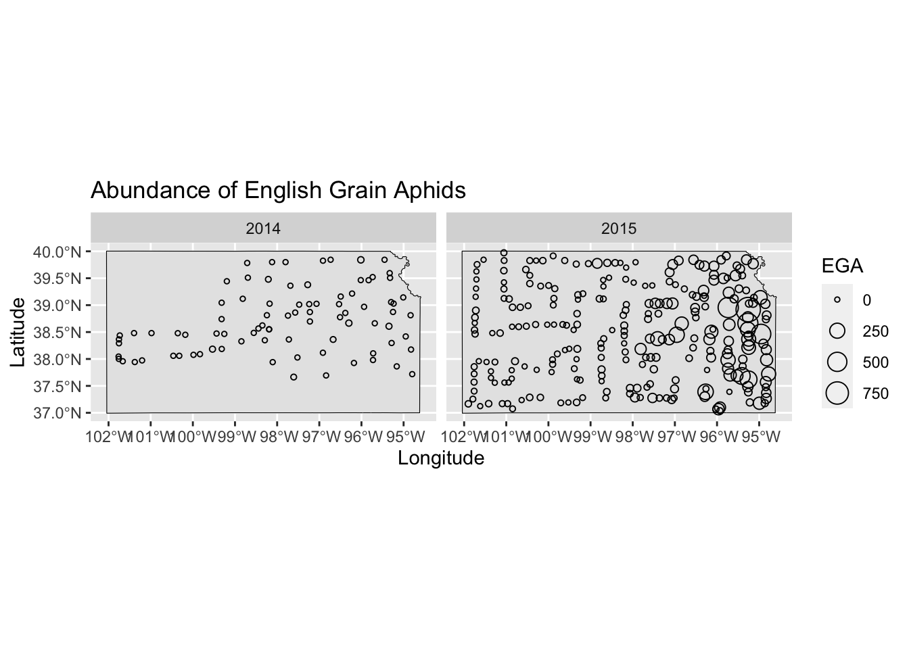
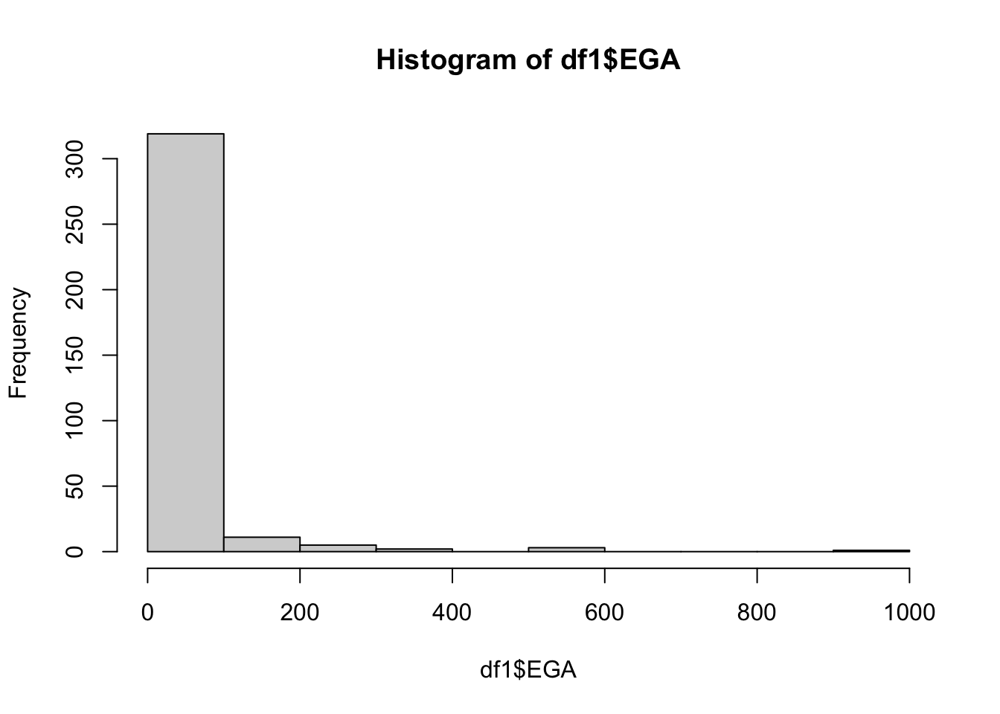
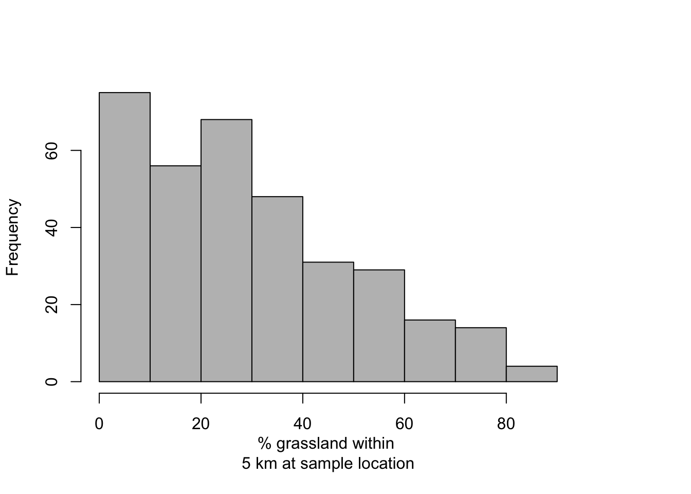

# Activity 3 


## Library 


```r
library(sf)
library(sp)
library(raster)
library(mgcv)
library(ggplot2)
library(dplyr)
```

## Import KS map and aphid data


```r
# Download data on English grain aphid

url <- "https://www.dropbox.com/scl/fi/9ymxt900s77uq50ca6dgc/Enders-et-al.-2018-data.csv?rlkey=0rxjwleenhgu0gvzow5p0x9xf&dl=1"
df1 <- read.csv(url)
df1 <- df1[,c(2,8:10)] # Keep only the data on English grain aphid

pts.sample <- data.frame(long = df1$long,lat = df1$lat, 
                         count = df1$EGA)
coordinates(pts.sample) =~ long + lat
proj4string(pts.sample) <- CRS("+proj=longlat +datum=WGS84 +no_defs +ellps=WGS84 +towgs84=0,0,0")
```

## Data visualization


```r
# Download KS shapefile
ks <- raster::getData(name="GADM", country="USA", level=1) %>% 
  st_as_sf() %>% 
  dplyr::filter(NAME_1 == "Kansas")

coordinates <- st_as_sf(df1, coords = c("long", "lat"), crs = st_crs(ks))

# Plot
ggplot() +
  geom_sf(data = ks, fill = "grey90", color = "black") +
  geom_point(data = df1, aes(x = long, y = lat, size = EGA), shape = 21) +
  #scale_fill_viridis_c (option = "viridis", direction = -1) +
  labs(title = "Abundance of English Grain Aphids", x = "Longitude", y = "Latitude")+
  facet_wrap(~year)
```



```r
hist(df1$EGA)
```



```r
# Download National Land Cover Database
url.nlcd <- "https://www.dropbox.com/scl/fi/ew7yzm93aes7l8l37cn65/KS_2011_NLCD.img?rlkey=60ahyvxhq18gt0yr47tuq5fig&dl=1"
rl.nlcd2011 <- raster(url.nlcd)

# Make raster file that contains pixels with value of 1 if grassland and 
# zero if other type of land cover.
plot(rl.nlcd2011)
```


```r
rl.nlcd.grass <- rl.nlcd2011
rl.nlcd.grass[] <- ifelse(rl.nlcd.grass[]==71,1,0)

plot(rl.nlcd.grass)
```


```r
# Calculate percentage of land area that is grassland withing 5 km of sampled location
df1$grass.perc <- unlist(lapply(extract(rl.nlcd.grass,pts.sample,buffer=5000),mean))*100

hist(df1$grass.perc,col="grey",main="",xlab="% grassland within \n5 km at sample location")
```



##1. For the data on the abundance of English grain aphids, propose three different statistical models (or machine learning approach) that are capable of predicting the number of English grain aphids at any location within the state of Kansas at any time for the years 2014 and 2015. Make sure to write out the three statistical models using formal notation and fully describe each component using words.

### Model 1

Data model
$$Z = y$$
Process model
Using Poisson distribution

$$[y|\lambda] = Poisson(\lambda) $$

$$\eta_s\sim MVN(0, \Sigma)$$
$$E(y)=e^{\beta_0+\beta_1\cdot X+\eta_s+\eta_t}$$

### Model 2

Data model

$$Z = y$$
Process model
Using Negative binomial distribution

$$[y|r,p] = NB(r, p)$$
$$\eta_s\sim MVN(0, \Sigma)$$
$$E(y)=e^{\beta_0+\beta_1\cdot X+\eta_s+\eta_t}$$
### Model 3

Data model

$$Z = y$$
Process model
Using zero inflated poisson distribution

$$[y|p, \lambda]=ZIP(p,\lambda)$$
$$\eta_s\sim MVN(0, \Sigma)$$
$$E(y)=e^{\beta_0+\beta_1\cdot X+\eta_s+\eta_t}$$

##2. For the three statistical models you proposed in question #1, propose a way to measure the accuracy (and perhaps the calibration) of predictions.

Mean square error and Mean absolute error

$$MSE = \frac{1}{n} \sum^n_{i=1}{(Y_i - \hat{Y}_i)^2}$$

$$MAE = \frac{\sum^n_{i=1} |y_i - x_i|}{n}$$
##3. Fit the three statistical models you proposed in question #1 to the English grain aphid abundance data.


```r
m1 <- gam(EGA ~ grass.perc + as.factor(year) + s(long,lat, bs = "gp"), 
          family = poisson(link = "log"), data = df1)

summary(m1)
```

```
## 
## Family: poisson 
## Link function: log 
## 
## Formula:
## EGA ~ grass.perc + as.factor(year) + s(long, lat, bs = "gp")
## 
## Parametric coefficients:
##                       Estimate Std. Error z value Pr(>|z|)    
## (Intercept)         -3.1624342  0.2629681 -12.026   <2e-16 ***
## grass.perc          -0.0084544  0.0009811  -8.617   <2e-16 ***
## as.factor(year)2015  5.5241770  0.2584600  21.373   <2e-16 ***
## ---
## Signif. codes:  0 '***' 0.001 '**' 0.01 '*' 0.05 '.' 0.1 ' ' 1
## 
## Approximate significance of smooth terms:
##               edf Ref.df Chi.sq p-value    
## s(long,lat) 31.97     32   8009  <2e-16 ***
## ---
## Signif. codes:  0 '***' 0.001 '**' 0.01 '*' 0.05 '.' 0.1 ' ' 1
## 
## R-sq.(adj) =  0.395   Deviance explained = 69.9%
## UBRE = 28.333  Scale est. = 1         n = 341
```

```r
m2 <- gam(EGA ~ grass.perc + as.factor(year) + s(long,lat, bs = "gp"), 
          family = nb(theta = NULL,link = "log"), data = df1)

summary(m2)
```

```
## 
## Family: Negative Binomial(0.623) 
## Link function: log 
## 
## Formula:
## EGA ~ grass.perc + as.factor(year) + s(long, lat, bs = "gp")
## 
## Parametric coefficients:
##                      Estimate Std. Error z value Pr(>|z|)    
## (Intercept)         -2.512753   0.343910  -7.306 2.74e-13 ***
## grass.perc          -0.005170   0.004665  -1.108    0.268    
## as.factor(year)2015  5.164253   0.325909  15.846  < 2e-16 ***
## ---
## Signif. codes:  0 '***' 0.001 '**' 0.01 '*' 0.05 '.' 0.1 ' ' 1
## 
## Approximate significance of smooth terms:
##               edf Ref.df Chi.sq p-value    
## s(long,lat) 8.884  11.75  372.1  <2e-16 ***
## ---
## Signif. codes:  0 '***' 0.001 '**' 0.01 '*' 0.05 '.' 0.1 ' ' 1
## 
## R-sq.(adj) =  0.247   Deviance explained = 68.6%
## -REML = 962.32  Scale est. = 1         n = 341
```

```r
m3 <- gam(list(EGA ~ grass.perc + as.factor(year) + s(long,lat, bs = "gp"), ~ s(long,lat, bs = "gp")), 
          family = ziplss(), data = df1)

summary(m3)
```

```
## 
## Family: ziplss 
## Link function: identity identity 
## 
## Formula:
## EGA ~ grass.perc + as.factor(year) + s(long, lat, bs = "gp")
## ~s(long, lat, bs = "gp")
## 
## Parametric coefficients:
##                       Estimate Std. Error z value Pr(>|z|)    
## (Intercept)         -1.5217298  0.3565564  -4.268 1.97e-05 ***
## grass.perc          -0.0098653  0.0009923  -9.942  < 2e-16 ***
## as.factor(year)2015  4.0446085  0.3513845  11.510  < 2e-16 ***
## (Intercept).1        0.0363224  0.0745315   0.487    0.626    
## ---
## Signif. codes:  0 '***' 0.001 '**' 0.01 '*' 0.05 '.' 0.1 ' ' 1
## 
## Approximate significance of smooth terms:
##                 edf Ref.df  Chi.sq  p-value    
## s(long,lat)   31.55  31.84 6583.32  < 2e-16 ***
## s.1(long,lat) 12.04  15.69   43.33 0.000236 ***
## ---
## Signif. codes:  0 '***' 0.001 '**' 0.01 '*' 0.05 '.' 0.1 ' ' 1
## 
## Deviance explained = 61.3%
## -REML = 5365.4  Scale est. = 1         n = 341
```

```r
AIC(m1, m2, m3)
```

```
##          df       AIC
## m1 34.97341 10896.425
## m2 13.90150  1913.024
## m3 49.13742 10462.936
```

```r
# Predict

newPoints <- st_sample(ks, size = 1000, type = "regular") %>% 
  as(., 'Spatial') %>% as.data.frame() %>% 
    rename("long" = "coords.x1", 
          "lat" = "coords.x2") %>% 
  cross_join(data.frame(year = as.factor(c('2014', '2015'))))

pts.sample<- newPoints

coordinates(pts.sample) =~ long + lat
proj4string(pts.sample) <- CRS("+proj=longlat +datum=WGS84 +no_defs +ellps=WGS84 +towgs84=0,0,0")

# Calculate percentage of land area that is grassland withing 5 km of new points location

newPoints$grass.perc <- unlist(lapply(extract(rl.nlcd.grass,pts.sample,buffer=5000),mean))*100

# Step 2: Use predict() to obtain predictions
newPoints$predictions.m1 <- predict(m1, newdata = newPoints, type = "response")
newPoints$predictions.m2 <- predict(m2, newdata = newPoints, type = "response")
newPoints$predictions.m3 <- predict(m3, newdata = newPoints, type = "response")


# View the predictions
pred <- st_as_sf(newPoints, coords = c("long", "lat"), crs = st_crs(ks), agr = 'constant')
```

##4. For the three models you fit in question #3, which model makes the most accurate predictions? How good is the best model in real world terms? Remember we are trying to predict the number of English grain aphids, which is a count!

Model 2 makes the most accurate predictions.


```r
AIC(m1, m2, m3)
```

```
##          df       AIC
## m1 34.97341 10896.425
## m2 13.90150  1913.024
## m3 49.13742 10462.936
```

##5. Summarize your results using words, numerical values and figures/maps.


```r
# m1
ggplot() +
  geom_tile(data = newPoints, aes(x = long, y = lat, fill = predictions.m1))+
  scale_fill_viridis_c(values = c(0, 0.00001, 0.0001, 0.001, 0.01, 0.1, 1))+ 
  labs(title = "Model 1 - Abundance of English grain aphids", x = "Longitude", y = "Latitude")+
  theme_bw()
```


```r
# m2
ggplot() +
  geom_tile(data = newPoints, aes(x = long, y = lat, fill = predictions.m2))+
  scale_fill_viridis_c()+ 
  labs(title = "Model 2 - Abundance of English grain aphids", x = "Longitude", y = "Latitude")+
  theme_bw()
```


```r
#m3 
ggplot() +
  geom_tile(data = newPoints, aes(x = long, y = lat, fill = predictions.m3))+
  scale_fill_viridis_c(values = c(0, 0.00001, 0.0001, 0.001, 0.01, 0.1, 1))+ 
  labs(title = "Model 3 - Abundance of English grain aphids", x = "Longitude", y = "Latitude")+
  theme_bw()
```


